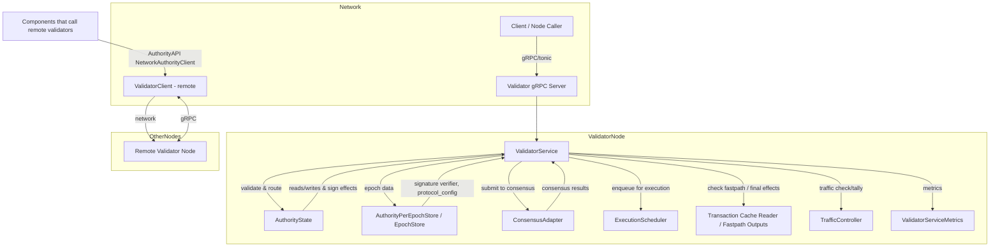

--------------------------------------------------------------------------------
1) Authority client (crates/sui-core/src/authority_client.rs)
--------------------------------------------------------------------------------

High-level purpose
- This file defines the AuthorityAPI trait (the abstract client interface used by other internal components to call networked validators) and a concrete network-backed client implementation NetworkAuthorityClient that uses the ValidatorClient gRPC client (sui_network) underneath. It also contains helpers to build per-authority clients from committee/network config and a small metadata helper.

Main items
- AuthorityAPI trait
- NetworkAuthorityClient struct + impls
- Helper functions to construct many NetworkAuthorityClient instances
- insert_metadata() helper

AuthorityAPI trait
- Purpose: abstract client calls that other modules can use to interact with an authority (validator) over the network. It is async (uses async_trait).
- Methods (signatures trimmed to key parts), and their intent:
  - submit_transaction(&self, request: SubmitTxRequest, client_addr: Option<SocketAddr>) -> Result<SubmitTxResponse, SuiError>
    - Sends a SubmitTxRequest to a validator for sequencing/certification/execution; returns SubmitTxResponse or SuiError.
  - wait_for_effects(&self, request: WaitForEffectsRequest, client_addr: Option<SocketAddr>) -> Result<WaitForEffectsResponse, SuiError>
    - Wait for effects for a previously-submitted tx (typically using consensus position or tx digest).
  - handle_transaction(&self, transaction: Transaction, client_addr: Option<SocketAddr>) -> Result<HandleTransactionResponse, SuiError>
    - Send a new (un-signed?) Transaction to a validator for handling (sequencing/execution).
  - handle_certificate_v2(&self, certificate: CertifiedTransaction, client_addr: Option<SocketAddr>) -> Result<HandleCertificateResponseV2, SuiError>
    - Execute a certificate (v2 response).
  - handle_certificate_v3(&self, request: HandleCertificateRequestV3, client_addr: Option<SocketAddr>) -> Result<HandleCertificateResponseV3, SuiError>
    - Execute a certificate (v3 richer response).
  - handle_soft_bundle_certificates_v3(&self, request: HandleSoftBundleCertificatesRequestV3, client_addr: Option<SocketAddr>) -> Result<HandleSoftBundleCertificatesResponseV3, SuiError>
    - Execute a soft bundle (multiple certificates, v3).
  - handle_object_info_request(&self, request: ObjectInfoRequest) -> Result<ObjectInfoResponse, SuiError>
    - Query object info.
  - handle_transaction_info_request(&self, request: TransactionInfoRequest) -> Result<TransactionInfoResponse, SuiError>
    - Query transaction info.
  - handle_checkpoint(&self, request: CheckpointRequest) -> Result<CheckpointResponse, SuiError>
    - Fetch checkpoint information (v1).
  - handle_checkpoint_v2(&self, request: CheckpointRequestV2) -> Result<CheckpointResponseV2, SuiError>
    - Fetch checkpoint information (v2 richer).
  - handle_system_state_object(&self, request: SystemStateRequest) -> Result<SuiSystemState, SuiError>
    - Fetch system state (benchmark usage; returns typed SuiSystemState).
  - validator_health(&self, request: ValidatorHealthRequest) -> Result<ValidatorHealthResponse, SuiError>
    - Get health metrics for latency/monitoring.

NetworkAuthorityClient struct
- Definition:
  - pub struct NetworkAuthorityClient { client: SuiResult<ValidatorClient<Channel>> }
    - client is a Result-wrapped gRPC client: either Ok(ValidatorClient<Channel>) or Err(...). Using SuiResult allows lazy connection schemes where the channel creation might have failed; the struct can carry that error to be surfaced when used.
- Purpose: concrete implementation of AuthorityAPI that routes calls over tonic/gRPC to a validator node (wraps sui_network::ValidatorClient).

NetworkAuthorityClient::methods and behavior
- connect(address: &Multiaddr, tls_target: NetworkPublicKey) -> Result<Self, anyhow::Error>
  - Establishes a rustls TLS client config (sui_tls::create_rustls_client_config with validator server name).
  - Uses mysten_network::client::connect(address, tls_config).await to open a Channel.
  - On success returns Self::new(channel).
  - Errors are mapped to anyhow errors with to_string.
- connect_lazy(address: &Multiaddr, tls_target: NetworkPublicKey) -> Self
  - Similar to connect, but calls mysten_network::client::connect_lazy which returns an immediate result (lazy channel) rather than awaiting a connection. That result is then mapped into ValidatorClient::new; errors are stored in client field as Err(...).
  - Preferred for creating many clients without blocking on connection establishment.
- new(channel: Channel) -> Self
  - Wraps a ready Channel into ValidatorClient and stores Ok(client).
- new_lazy(client: SuiResult<Channel>) -> Self (private)
  - Accepts a SuiResult<Channel> and maps to client.map(ValidatorClient::new).
- client(&self) -> SuiResult<ValidatorClient<Channel>>
  - Return a clone of the stored ValidatorClient or the stored error. This function centralizes access to the underlying client and surfaces lazy creation errors.
- get_client_for_testing(&self) -> SuiResult<ValidatorClient<Channel>>
  - Simple wrapper around client(); used in tests.

AuthorityAPI implementation for NetworkAuthorityClient
- The impl converts typed requests into raw gRPC requests, inserts optional metadata (client IP forwarded header) and calls the corresponding method on the inner ValidatorClient, handling conversions between protobuf/raw types and typed types and converting errors to SuiError.

Detailed per-method actions (common pattern):
- For many methods the implementation:
  1. Convert the typed request into either a raw representation or into a tonic::Request (by calling into_request() on the typed type or on its raw wrapper).
  2. Call insert_metadata(&mut request, client_addr) which will set an "x-forwarded-for" metadata entry when client_addr is provided.
  3. Use self.client()? to get ValidatorClient<Channel>. If there was a prior error creating the client, this surfaces the error.
  4. Call client.method(request).await, map tonic::Response::into_inner, map errors into SuiError, and convert the raw response into typed structs via try_into() where appropriate.
- Specifics:
  - submit_transaction: call submit_transaction RPC; request is converted into a Raw and then into tonic::Request.
  - wait_for_effects: converts WaitForEffectsRequest into RawWaitForEffectsRequest (try_into) then into tonic::Request; call wait_for_effects RPC and convert raw response back into typed WaitForEffectsResponse by try_into.
  - handle_transaction: call transaction RPC with a Transaction message; return HandleTransactionResponse.
  - handle_certificate_v2/v3: build request from certificate or request wrapper; call handle_certificate_v2/handle_certificate_v3.
  - handle_soft_bundle_certificates_v3: call handle_soft_bundle_certificates_v3.
  - object_info/transaction_info/checkpoint/checkpoint_v2/system_state_object/validator_health: each calls the appropriate RPC and does conversions. validator_health converts ValidatorHealthRequest to RawValidatorHealthRequest, calls validator_health raw, then try_into() to typed response.

Helper functions
- make_network_authority_clients_with_network_config(committee: &CommitteeWithNetworkMetadata, network_config: &Config) -> BTreeMap<AuthorityName, NetworkAuthorityClient>
  - For each validator in the committee:
    - Retrieves network_address from network_metadata, rewrites protocols to use TCP/HTTPS where necessary.
    - Builds a TLS client config from network_public_key if available; if key missing, it yields an Err(SuiError::from("network public key is not available")) that is propagated into maybe_channel.
    - Uses network_config.connect_lazy(&address, tls_config) to obtain a lazy Channel Result; maps into NetworkAuthorityClient::new_lazy(maybe_channel).
    - Logs errors when connect_lazy fails to create client and inserts NetworkAuthorityClient with client possibly containing an Err.
  - Returns BTreeMap mapping AuthorityName -> NetworkAuthorityClient.
- make_authority_clients_with_timeout_config(committee, connect_timeout, request_timeout) -> BTreeMap<AuthorityName, NetworkAuthorityClient>
  - Makes a mysten_network::config::Config with provided timeouts and then calls make_network_authority_clients_with_network_config.

insert_metadata(request: &mut tonic::Request<T>, client_addr: Option<SocketAddr>)
- If client_addr is Some, it builds a MetadataMap and inserts a header "x-forwarded-for" = client_addr.to_string().
- It then iterates through metadata entries and inserts them into request.metadata_mut(), either as ASCII or binary key/value, by matching KeyAndValueRef.
- Purpose: allow server-side code to extract client IP address via metadata when the client passed it through (or to allow proxies to forward).

Boundaries & notes (client)
- NetworkAuthorityClient is a thin wrapper over the generated gRPC ValidatorClient; it only handles request conversion, optional header injection, and response conversion.
- Errors from channel creation are stored in the struct and surfaced when a call attempts to use the client.
- Conversions rely on IntoRequest / TryFrom implementations (proto <-> typed), so the client code expects those conversions exist.

--------------------------------------------------------------------------------
2) Authority server (crates/sui-core/src/authority_server.rs)
--------------------------------------------------------------------------------

High-level purpose
- Implements the server-side validator service (gRPC) that receives client RPCs and interacts with the local AuthorityState, ConsensusAdapter, ExecutionScheduler, TrafficController, epoch stores, caches, and other internal machinery to process transactions, certificates, queries, and health checks. Also records metrics (prometheus histograms, counters) for many operations.

Main structs and their roles
- AuthorityServerHandle
  - Fields:
    - server_handle: sui_network::validator::server::Server
  - Purpose: a handle returned by spawn/bind operations for an AuthorityServer; offers functions to join (wait for shutdown), kill (shutdown), and inspect address.
  - Methods:
    - join(self) -> waits for shutdown (handle().wait_for_shutdown().await).
    - kill(self) -> calls server_handle.handle().shutdown().await.
    - address(&self) -> &Multiaddr returns local bind address.

- AuthorityServer
  - Fields:
    - address: Multiaddr
    - state: Arc<AuthorityState>
    - consensus_adapter: Arc<ConsensusAdapter>
    - metrics: Arc<ValidatorServiceMetrics>
  - Purpose: helper used in tests to spawn a full validator server instance. (production server creation is delegated to other layers).
  - Methods:
    - new_for_test_with_consensus_adapter(state, consensus_adapter) -> Self
      - Creates address via new_local_tcp_address_for_testing() and metrics via new_for_tests(), and sets fields.
    - new_for_test(state) -> Self
      - Constructs ConsensusAdapter with LazyMysticetiClient, CheckpointStore::new_for_tests(), config derived from state, etc., then calls new_for_test_with_consensus_adapter.
    - spawn_for_test(self) -> spawn_with_bind_address_for_test(self.address)
    - spawn_with_bind_address_for_test(self, address) -> Binds a network server:
      - Configures rustls server TLS config from state's network key pair.
      - Builds a server via sui_network::validator::server::ServerBuilder::from_config, adds service ValidatorServer::new(ValidatorService::new_for_tests(...)).
      - Binds to address with tls_config, returns AuthorityServerHandle.

- ValidatorServiceMetrics
  - A collection of Prometheus metrics (many Histograms, HistogramVecs, IntCounters, etc), created on ValidatorService construction.
  - Purpose: record latencies, counts, sizes, rejection metrics, forwarded header metrics, traffic control metrics. Metrics are used heavily in service handlers to record performance and errors.

- ValidatorService
  - Fields:
    - state: Arc<AuthorityState>
    - consensus_adapter: Arc<ConsensusAdapter>
    - metrics: Arc<ValidatorServiceMetrics>
    - traffic_controller: Option<Arc<TrafficController>>
    - client_id_source: Option<ClientIdSource>
  - Purpose: implements the network Validator (gRPC) service – the actual request handlers for all RPCs listed in AuthorityAPI but on the server side. It orchestrates validation, signature verification, consensus submission, execution, caches, and responses.

ValidatorService constructors
- new(state, consensus_adapter, validator_metrics, client_id_source) -> Self
  - Uses state's traffic_controller.clone() to populate traffic controller.
- new_for_tests(state, consensus_adapter, metrics) -> Self
  - Creates a ValidatorService for tests with no traffic_controller and no client_id_source.

Small helpers / types
- type WrappedServiceResponse<T> = Result<(tonic::Response<T>, Weight), tonic::Status>
  - Internal wrapper used by many impl functions to return both the gRPC response and a "Weight" metric for traffic tallying.
- make_tonic_request_for_testing<T>(message:T) -> tonic::Request<T>
  - In tests, synthesize a Request with TcpConnectInfo extension inserted so downstream code believes request came from TCP.

Key server methods (detailed)
Note: many methods are split into two layers: an impl method that returns WrappedServiceResponse and an interface method used by the implemented Validator trait which calls handle_with_decoration! macro for traffic control. I focus on impl methods and the overall flow.

A) handle_transaction (impl)
- Signature: async fn handle_transaction(&self, request: tonic::Request<Transaction>) -> WrappedServiceResponse<HandleTransactionResponse>
- Main flow:
  1. Extract transaction from request, get epoch_store.
  2. Call transaction.validity_check(&epoch_store.tx_validity_check_context()) to ensure basic validity.
  3. Check system overload via state.check_system_overload(...). If overloaded, increment metrics (num_rejected_tx_during_overload). If the error kind is ValidatorOverloadedRetryAfter, set validator_pushback_error = Some(error) but continue; otherwise return error.
     - Important note: even when overloaded, it still locks input objects (to avoid starvation/deadlocks across validators), but returns an error to client (retry).
  4. Start metrics timer for handle_transaction and tx verification.
  5. epoch_store.verify_transaction(transaction) to verify signatures; if fails, increment signature_errors and return error.
  6. Compute tx_digest and create a tracing span using tx_digest.
  7. Call state.handle_transaction(&epoch_store, transaction.clone()).await to have AuthorityState handle transaction creation/signing and to return info. That call may return errors, including ValidatorHaltedAtEpochEnd; when that occurs metrics.num_rejected_tx_in_epoch_boundary is incremented.
  8. If validator_pushback_error set earlier, return that error now (note: code signs txn but returns pushback).
  9. Return tonic::Response::new(info) and Weight::zero().
- Weight: returns Weight::zero() on success; the outer traffic handling will use it as spam_weight.

B) handle_submit_transaction (impl)
- Signature: async fn handle_submit_transaction(&self, request: tonic::Request<RawSubmitTxRequest>) -> WrappedServiceResponse<RawSubmitTxResponse>
- This is the critical (and large) entrypoint for batching, soft bundles, ping, and fastpath logic. This method is fairly complex; main responsibilities:
  1. Determine submitter client address using client_id_source or default socket source (calls get_client_ip_addr).
  2. Ensure Mysticeti fastpath is enabled in protocol_config (epoch_store.protocol_config().mysticeti_fastpath()), otherwise return UnsupportedFeatureError.
  3. Deserialize the RawSubmitTxRequest into a typed SubmitTxType (Ping, SoftBundle, Default). Validate constraints: ping requests must have zero transactions, other types must have at least one; enforce max number of transactions depending on type.
  4. Initialize vectors: tx_digests, consensus_transactions (Vec<ConsensusTransaction>), transaction_indexes, results Vec (Option<SubmitTxResult>) for each requested tx, total_size_bytes.
  5. For each transaction in request.transactions:
     - bcs::from_bytes::<Transaction> to deserialize; if fails, return TransactionDeserializationError and abort entire call.
     - validity_check on transaction; converts to tx_size.
     - check system overload: if overloaded mark results[idx] = Some(Rejected{error}) and continue to next transaction (do not abort the whole batch).
     - Verify transaction signatures via epoch_store.verify_transaction(transaction) (metrics tx_verification_latency); if verification fails increment signature_errors and return error.
     - Check transaction cache for executed effects (fast exit for already-executed tx):
       - If effects already exist, call complete_executed_data(effects, None).await to prepare ExecutedData and set results[idx] = Some(Executed{effects_digest, details, fast_path:false}) and continue.
     - Wait for fastpath dependency objects via state.wait_for_fastpath_dependency_objects(...).await?; this ensures fastpath dependencies are present (and it may timeout/return false).
     - state.handle_vote_transaction(&epoch_store, verified_transaction.clone()):
       - If Ok -> proceed to build a ConsensusTransaction::new_user_transaction_message and push into consensus_transactions, store index mapping.
       - If Err(e):
         - Re-check executed effects (race case), and if executed then set results[idx] = Executed and continue.
         - Otherwise, record metrics.submission_rejected_transactions label with the error variant name, set results[idx] = Rejected { error } and continue.
     - total_size_bytes accumulates transaction size.
   6. After processing transactions:
     - If consensus_transactions empty and not a ping -> return constructed response from results (try_from_submit_tx_response).
     - Enforce total_size_bytes <= max_transaction_bytes (which depends on soft_bundle request vs others). If exceed -> return UserInputError TotalTransactionSizeTooLargeInBatch.
     - Record metrics for bytes/ batch size.
   7. Submit to consensus:
     - If is_soft_bundle_request or is_ping_request:
       - Call handle_submit_to_consensus_for_position(consensus_transactions, &epoch_store, submitter_client_addr).await? — returns Vec<ConsensusPosition>.
         - Soft bundle and ping request attempt to get consensus position for the whole bundle.
     - Else (normal batch or single tx):
       - For each consensus transaction, call handle_submit_to_consensus_for_position(vec![t], &epoch_store, submitter_client_addr) (each returned Future returns positions); run them in parallel via future::try_join_all; flatten resulting lists into one Vec<ConsensusPosition>.
   8. For ping: return special Submitted result with consensus position.
   9. For normal requests: map consensus positions back to original transaction request indexes and set results[idx] = Some(Submitted{consensus_position}).
   10. Return aggregated RawSubmitTxResponse via try_from_submit_tx_response(results).

- Important behaviors:
  - The method tolerates per-transaction failures inside a batch (some transactions can be rejected while others submitted).
  - It prefers to reject/record at per-item level instead of aborting entire batch when possible.
  - It integrates with fastpath / Mysticeti: waits on fastpath dependencies, checks consensus_tx_status_cache for various statuses, uses the consensus adapter to submit batches and obtain positions.
  - It records many metrics across the flow.

C) try_from_submit_tx_response(results: Vec<Option<SubmitTxResult>>) -> Result<RawSubmitTxResponse, SuiError>
- Converts per-transaction Option<SubmitTxResult> into raw results. If any entry is None -> returns GenericAuthorityError "Missing transaction result at i".

D) handle_certificates(certificates: NonEmpty<CertifiedTransaction>, include_events, include_input_objects, include_output_objects, include_auxiliary_data, epoch_store, wait_for_effects) -> Result<(Option<Vec<HandleCertificateResponseV3>>, Weight), tonic::Status>
- Purpose: central logic for processing certificates (single certificate or soft-bundle). Returns optionally executed responses (wrapped as HandleCertificateResponseV3) and a Weight spam weight.
- Main flow:
  1. Reject if this node is a fullnode for this epoch (fullnodes don't handle certificate execution).
  2. Detect whether any certificate in the bundle is a consensus transaction (is_consensus_tx).
  3. Choose correct metrics guard depending on single vs bundle and whether wait_for_effects is set.
  4. If single certificate: check if already executed by calling state.get_signed_effects_and_maybe_resign(&tx_digest, epoch_store). If present, optionally fetch events, and return an immediate HandleCertificateResponseV3 with those effects and events. This short-circuits to avoid resubmitting an already-executed certificate.
  5. For each certificate: check system overload (state.check_system_overload) at execution time. On overload increment metrics.num_rejected_cert_during_overload and return error.
  6. Verify certificates signatures: epoch_store.signature_verifier.multi_verify_certs(certificates.into()).await -> returns Vec<VerifiedCertificate>.
  7. Wrap each verified cert as ConsensusTransaction::new_certificate_message and collect NonEmpty consensus transactions.
  8. Call handle_submit_to_consensus with those consensus transactions and options (include_events etc.) and wait_for_effects flag. This returns Option<Vec<ExecutedData>> and Weight. (Note: handle_submit_to_consensus performs submission, possible execution/waiting, and returns executed results.)
  9. If responses exist, sign effects via self.state.sign_effects(response.effects, epoch_store)? and convert each ExecutedData into HandleCertificateResponseV3 with signed effects and optional input/output objects (convert empty vecs to None).
  10. Return responses and spam weight.

E) handle_submit_to_consensus_for_position(consensus_transactions: Vec<ConsensusTransaction>, epoch_store, submitter_client_addr) -> Result<Vec<ConsensusPosition>, tonic::Status>
- Purpose: submit a vector of consensus transactions and return their positions. This version returns positions via a oneshot channel provided to ConsensusAdapter::submit_batch.
- Main steps:
  1. Acquire reconfiguration lock: epoch_store.get_reconfig_state_read_lock_guard(). If !should_accept_user_certs() -> metric increment num_rejected_cert_in_epoch_boundary; return ValidatorHaltedAtEpochEnd.
  2. Start consensus latency metric timer.
  3. Call consensus_adapter.submit_batch(&consensus_transactions, Some(&reconfiguration_lock), epoch_store, Some(tx_consensus_positions), submitter_client_addr). If this returns Err -> map to tonic::Status.
  4. Await the rx_consensus_positions oneshot channel to get the positions. If channel closed, return FailedToSubmitToConsensus.
- Note: Because this call passes Some(tx_consensus_positions) it expects to be given back the positions via the oneshot if the consensus adapter will provide per-batch positions (used by the "position" API flow).

F) handle_submit_to_consensus(consensus_transactions: NonEmpty<ConsensusTransaction>, include_events, include_input_objects, include_output_objects, epoch_store, wait_for_effects) -> Result<(Option<Vec<ExecutedData>>, Weight), tonic::Status>
- Purpose: main routine for submitting consensus transactions and optionally waiting/executing them and collecting execution outputs (ExecutedData).
- Main steps:
  1. Acquire reconfiguration lock (read). If !should_accept_user_certs() then refused by epoch boundary.
  2. Quick check: if epoch_store.all_external_consensus_messages_processed(...)? returns false (i.e., not all relevant consensus messages have been processed) then call consensus_adapter.submit_batch(..., None, None) to submit them. This call doesn't provide a oneshot handle back — it submits to consensus and returns immediately; semantics depend on whether txs are shared object certs vs owned (if shared the code later waits for sequencing).
  3. If wait_for_effects == false:
     - For certified transactions that are not consensus-only (i.e., owned objects or non-consensus certs) enqueue them in execution_scheduler for local execution via state.execution_scheduler().enqueue. Return (None, Weight::zero()) since not waiting for effects.
  4. If wait_for_effects == true:
     - For each consensus transaction, if it's a CertifiedTransaction, call self.state.wait_for_certificate_execution(&certificate, epoch_store).await to wait for execution effects; if it's a UserTransaction, call self.state.await_transaction_effects(*tx.digest(), epoch_store).await. Collect events, input objects, output objects according to include_* flags using state.get_transaction_events/get_transaction_input_objects/get_transaction_output_objects. If certificate type, call epoch_store.insert_tx_cert_sig(certificate.digest(), certificate.auth_sig()) to persist signature info.
     - Wrap outputs into ExecutedData entries and return Ok((Some(responses), Weight::zero())).
- Note: This function is core: it ensures transactions are submitted to consensus when needed; if waiting for effects it waits and returns executed outputs.

G) collect_effects_data(effects: &TransactionEffects, include_events, include_input_objects, include_output_objects, fastpath_outputs: Option<Arc<TransactionOutputs>>) -> SuiResult<(Option<TransactionEvents>, Vec<Object>, Vec<Object>)>
- Purpose: gather events, input objects, output objects for a given effects. If fastpath_outputs (fastpath cached outputs) provided, use those to avoid reading from DB.
- Returns tuple: (Option<events>, Vec<input objects>, Vec<output objects>).

H) transaction_impl / handle_submit_transaction_impl / submit_certificate_impl / handle_certificate_v2_impl / handle_certificate_v3_impl / wait_for_effects_impl / handle_soft_bundle_certificates_v3_impl / object_info_impl / transaction_info_impl / checkpoint_impl / checkpoint_v2_impl / get_system_state_object_impl / validator_health_impl
- These are thin impl wrappers that call the main logic and adapt signatures to WrappedServiceResponse or unwrap types as required, e.g.:
  - submit_certificate_impl wraps handle_certificates called with nonempty![certificate] and returns SubmitCertificateResponse.
  - handle_certificate_v2_impl uses handle_certificates with wait_for_effects=true and returns HandleCertificateResponseV2 (converted from v3).
  - handle_certificate_v3_impl uses HandleCertificateRequestV3 fields and waits for effects (true).
  - wait_for_effects_impl receives RawWaitForEffectsRequest, converts to typed WaitForEffectsRequest, then calls epoch_store.within_alive_epoch(self.wait_for_effects_response(request, &epoch_store)) inside a timeout of 20s (TODO note to tune). After awaiting it returns raw response (try_into).
  - validator_health_impl reads several internal metrics from state and consensus_adapter and creates a RawValidatorHealthResponse.

I) wait_for_effects_response(request: WaitForEffectsRequest, epoch_store) -> SuiResult<WaitForEffectsResponse>
- Purpose: central logic to produce a WaitForEffectsResponse for a given request (handles both ping and normal flows).
- Behavior:
  - If request includes ping_type: call ping_response(request, epoch_store) with a 10s timeout (distinct code path).
  - Ensure transaction_digest exists in request (else InvalidRequest).
  - Build fastpath_effects_future:
    - If request.consensus_position is Some -> spawn wait_for_fastpath_effects(consensus_position, tx_digests, include_details, epoch_store) as a pinned future; else set to pending.
  - tokio::select! biased:
    - First branch: wait for final (finalized) effects via self.state.get_transaction_cache_reader().notify_read_executed_effects(...). This branch prioritized; when finalized effects arrive, return WaitForEffectsResponse::Executed { effects_digest, details, fast_path:false }.
    - Second branch: await the fastpath_effects_future (which complete only if consensus position is provided and fastpath outputs exist); if fastpath_response completes, return it (may be FastPath executed).
- Notes:
  - This design prioritizes finalized effects over fastpath outputs to ensure correctness.
  - Uses get_transaction_cache_reader.notify_read_executed_effects to wait for finalized effects (reader yields effects when they appear).

J) ping_response(request: WaitForEffectsRequest, epoch_store) -> SuiResult<WaitForEffectsResponse>
- Purpose: Ping path for fastpath status queries using consensus_tx_status_cache.
- Precondition: consensus_tx_status_cache must exist in epoch_store (else unsupported feature error).
- Steps:
  1. Ensure consensus_position present and ping_type present.
  2. Record metrics handle_wait_for_effects_ping_latency by ping type.
  3. consensus_tx_status_cache.check_position_too_ahead(consensus_position)? to validate not impossible far-ahead.
  4. Loop:
     - call consensus_tx_status_cache.notify_read_transaction_status_change(consensus_position, last_status).await to wait for status change from last_status.
     - If returned Status(ConsensusTxStatus):
       - FastpathCertified:
         - If ping == PingType::Consensus: set last_status and continue waiting (we need finalization for consensus pings).
         - Else return WaitForEffectsResponse::Executed { effects_digest: ZERO, details: maybe empty ExecutedData, fast_path:true }.
       - Rejected -> return WaitForEffectsResponse::Rejected { error: None }.
       - Finalized -> return WaitForEffectsResponse::Executed { effects_digest: ZERO, details, fast_path:false }.
     - If Expired(round) -> return WaitForEffectsResponse::Expired { epoch, round }.
- Note: Ping pathway's responses use TransactionEffectsDigest::ZERO for the digest because ping only indicates status, not actual effects.

K) wait_for_fastpath_effects(consensus_position, tx_digests, include_details, epoch_store) -> SuiResult<WaitForEffectsResponse>
- Purpose: Wait for fastpath (Mysticeti) outputs corresponding to a consensus position, handling epoch comparisons and status changes.
- Steps:
  1. Ensure consensus_tx_status_cache exists, else unsupported feature error.
  2. Compare consensus_position.epoch vs local_epoch:
     - If Less -> return Expired (ask client to re-submit).
     - If Greater -> return WrongEpoch (ask client to retry when epoch catches up).
     - Equal -> proceed.
  3. consensus_tx_status_cache.check_position_too_ahead(&consensus_position)?
  4. Loop:
     - Wait on consensus_tx_status_cache.notify_read_transaction_status_change(consensus_position, current_status) to get status updates.
       - If Rejected -> return Rejected with optional rejection vote reason.
       - If FastpathCertified -> set current_status = Some(FastpathCertified) and continue (still waiting for outputs).
       - If Finalized -> set current_status = Some(Finalized) and continue.
     - Concurrently wait for fastpath outputs via get_transaction_cache_reader().notify_read_fastpath_transaction_outputs(tx_digests) but only accept outputs when current_status is FastpathCertified or Finalized (guard condition). When outputs appear, prepare details via complete_executed_data(effects.clone(), Some(outputs)).await? and return WaitForEffectsResponse::Executed with fast_path flag set to current_status == FastpathCertified.
- The loop effectively waits until the fastpath outputs exist while watching consensus tx status changes so it can return rejected/expired/finalized appropriately.

L) complete_executed_data(effects, fastpath_outputs) -> returns Box<ExecutedData>
- Gathers events, input objects, output objects (calls collect_effects_data) and returns a boxed ExecutedData { effects, events, input_objects, output_objects }.

M) soft_bundle_validity_check(certificates, epoch_store, total_size_bytes) -> Result<(), tonic::Status>
- Purpose: validate a soft-bundle of certificates pre-submission per SIP-19 rules.
- Checks:
  - Soft bundle enabled in protocol_config and local node config (node_config.enable_soft_bundle).
  - certificates.len() <= protocol_config.max_soft_bundle_size()
  - total_size_bytes <= soft_bundle_max_size_bytes (consensus_max_transactions_in_block_bytes / 2).
  - For each certificate:
    - Must be a consensus_tx (i.e., access at least one shared object).
    - Must not be already executed (is_tx_already_executed).
    - All certs must have identical gas_price (enforce gas price equality).
  - epoch_store.is_any_tx_certs_consensus_message_processed(certificates.iter())? must be false (i.e., none are already processed).
- On any failure returns appropriate UserInputError or UnsupportedFeatureError.

N) handle_soft_bundle_certificates_v3_impl(request) -> WrappedServiceResponse<HandleSoftBundleCertificatesResponseV3>
- Extract certificates from request.certificates into NonEmpty; calculate total_size_bytes (certificate.validity_check for each), record metrics (count and size), call soft_bundle_validity_check, log bundle details, call handle_certificates(certificates, include_events..., wait_for_effects= request.wait_for_effects). Map response into HandleSoftBundleCertificatesResponseV3 responses vector.

O) object_info_impl / transaction_info_impl / checkpoint_impl / checkpoint_v2_impl / get_system_state_object_impl / validator_health_impl
- Each calls into state (or epoch_store) to produce a response and wraps in tonic::Response. validator_health_impl collects runtime metrics: number of in-flight execution txs, in-flight consensus txs, last_committed_leader_round (via consensus_tx_status_cache), last_locally_built_checkpoint (via epoch_store.last_built_checkpoint_summary), and returns those as RawValidatorHealthResponse.

Traffic control and client ip extraction
- get_client_ip_addr<T>(&self, request: &tonic::Request<T>, source: &ClientIdSource) -> Option<IpAddr>
  - Purpose: extract client IP from either the socket (remote_addr extension) or the x-forwarded-for header depending on configured ClientIdSource.
  - If the header exists, x-forwarded-for number of hops is counted and stored in metrics.x_forwarded_for_num_hops.
  - If ClientIdSource::SocketAddr:
    - request.remote_addr() is used (tonic supports TcpConnectInfo stored in Request extensions).
    - If absent, metrics.connection_ip_not_found++ and logs error (special-case for sim/test).
  - If ClientIdSource::XForwardedFor(num_hops):
    - Parse header string, count contents, verify there are at least num_hops items; extract the correct hop (contents_len - num_hops) and parse_ip(client_ip). On parse errors increment metrics.forwarded_header_parse_error or forwarded_header_invalid as appropriate. If header missing increment forwarded_header_not_included and log error.
- handle_traffic_req(&self, client: Option<IpAddr>) -> Result<(), tonic::Status>
  - If traffic_controller present, call traffic_controller.check(&client, &None).await and convert false into TooManyRequests error. Otherwise Ok.
- handle_traffic_resp<T>(&self, client: Option<IpAddr>, wrapped_response: WrappedServiceResponse<T>) -> Result<tonic::Response<T>, tonic::Status>
  - Unwraps wrapped_response into either Ok((result, spam_weight)) or Err(status) and derive error and spam_weight.
  - If traffic_controller present call traffic_controller.tally(TrafficTally{direct: client, through_fullnode: None, error_info: option, spam_weight, timestamp}) to log traffic tally. error_info encodes error variant string and computed weight via normalize(err).
  - Return unwrapped_result (Ok/Err) to caller.

Weight normalization
- fn normalize(err: SuiError) -> Weight
  - Map certain user signature/invalid signer/wrong epoch and similar error kinds to Weight::one(), others to Weight::zero().
  - This is used to measure "spam weight" of erroneous requests to traffic_controller.

Macro handle_with_decoration!
- Purpose: uniform pre/post processing wrapper used by Validator trait methods.
- Behavior:
  - If self.client_id_source is None: immediately call inner method and return only tonic::Response result (ignore traffic counting).
  - Else:
    - Extract client ip via get_client_ip_addr with configured client_id_source.
    - Call self.handle_traffic_req(client.clone()).await? to check if blocked (early return TooManyRequests).
    - Call the inner method (e.g., handle_submit_transaction_impl) to get wrapped_response (which yields response + spam_weight).
    - Call self.handle_traffic_resp(client, wrapped_response) to tally and return the unwrapped result.
- This macro is invoked by all Validator trait implementations to ensure traffic control & tally is applied consistently.

Validator trait implementation for ValidatorService
- The gRPC (sui_network::api::Validator) trait is implemented for ValidatorService.
- For heavy/long-running endpoints that should continue if client disconnects (submit_transaction, transaction, submit_certificate) the implementation spawns a monitored task (spawn_monitored_task!) that runs the decorated handler asynchronously and continues even if client connection is dropped. The inner tasks call handle_with_decoration! to apply traffic control/tallying. The spawned task returns a Result<tonic::Response<...>, tonic::Status> and the trait implementation awaits the spawned task and returns its result.
- For synchronous endpoints (or non-spawned ones), handle_with_decoration! is called directly (which may call internal method that returns quickly).

Other helpers
- normalize (covered above)
- make_tonic_request_for_testing (testing support)

Boundaries & relationships (text)
- ValidatorService sits at the network boundary:
  - It receives gRPC/Tonic requests (via sui_network::validator::ValidatorServer).
  - It extracts client identity from the TCP connect info or x-forwarded-for header (tonic Request's metadata/extensions) to support traffic control and logging.
- Core responsibilities and collaborators:
  - AuthorityState:
    - Central local state object, used for object storage reads/writes, caches, execution scheduler, transaction signature handling, sign_effects, handle_transaction, handle_vote_transaction, get_transaction_input/output objects, get_transaction_events, get_transaction_cache_reader etc.
    - ValidatorService delegates transaction/certificate validation, checking execution caches, enqueueing execution, signing effects, reading system state, and checkpoint handling to AuthorityState.
  - AuthorityPerEpochStore / Epoch store:
    - ValidatorService retrieves epoch_store via state.load_epoch_store_one_call_per_task() to access signature_verifier, protocol_config, consensus_tx_status_cache, reconfiguration locks, and other epoch-scoped data.
    - Epoch store used to validate transactions, check protocol features (fastpath, soft bundles), and consult caches and consensus status.
  - ConsensusAdapter:
    - Used to submit batches to consensus (submit_batch). Two variants used:
      - submit_batch with a oneshot tx_consensus_positions to get consensus positions back (used for position-seeking RPC).
      - submit_batch without oneshot: submits to consensus without waiting for position, used when not requiring immediate positions.
    - Also used to get num_inflight_transactions for health checks.
  - ExecutionScheduler:
    - ValidatorService may enqueue certificates for local execution (fastpath or non-waiting flows) into the ExecutionScheduler, via state.execution_scheduler().enqueue.
  - Transaction cache reader / fastpath outputs:
    - ValidatorService interacts with a transaction cache reader to wait for executed effects (notify_read_executed_effects) or fastpath outputs for mysticeti fastpath (notify_read_fastpath_transaction_outputs).
  - TrafficController & ClientIdSource:
    - ValidatorService optionally checks traffic restrictions and tallies responses to control rate-limiting / blocklists.
    - get_client_ip_addr uses ClientIdSource config to decide how to extract client identity.
  - CheckpointStore, LazyMysticetiClient:
    - Used when creating consensus_adapter for tests, but production ConsensusAdapter interacts with the network consensus layer, which itself uses other adapters like mysticeti.
  - Network (sui_network / tonic):
    - NetworkAuthorityClient uses sui_network::ValidatorClient over tonic channels.
    - ValidatorService implements the network Validator trait and is wrapped into a ValidatorServer which binds to a socket with TLS config and listens for incoming requests.
  - Metrics (Prometheus registry):
    - ValidatorServiceMetrics is configured and used extensively to record latencies, counts, and error types. This is exposed to monitoring.

Boundaries summary
- External inbound boundary: gRPC API (sui_network/tonic) -> ValidatorService request handlers.
- Internal orchestration: ValidatorService -> AuthorityState / epoch store / consensus adapter / execution scheduler / caches.
- External outbound boundary: ValidatorService -> Consensus (via ConsensusAdapter) and also -> other validators (NetworkAuthorityClient used by other components to call remote validators).
- Traffic control is in middleware (get_client_ip_addr + handle_traffic_req + handle_traffic_resp) and applied on almost all handlers via macro.

Mermaid diagram (text)
- The diagram below shows the main components and connections; it is intended as a quick visual guide for relationships. Copy into any mermaid-capable renderer.

(Explanation for diagram)
- Client calls ValidatorServer (tonic) which dispatches to ValidatorService.
- ValidatorService orchestrates with AuthorityState and epoch data; it may submit transactions/certs to ConsensusAdapter and/or ExecutionScheduler and await outputs via caches.
- NetworkAuthorityClient (used by other modules) uses the generated ValidatorClient gRPC stub to call remote validators.

--------------------------------------------------------------------------------
3) Exhaustive method-level mechanics and noteworthy behaviors / corner cases
--------------------------------------------------------------------------------

Important invariants and details (exhaustive highlights)
- Overload handling:
  - There are two overload checks: one used during transaction submission (at signing) and a subsequent one at execution time for certificates. Overload returns a SuiError whose variant may instruct the caller to retry after some time or indicate inability to accept.
  - For handle_transaction (user transaction creation), the node still locks objects even if it plans to pushback (retry), to avoid long-lived object lock conflicts across validators.
  - In handle_submit_transaction per-transaction overload results are recorded as per-item rejections (result vector).
- Signature verification:
  - Verification of transactions is done through epoch_store.verify_transaction and multi_certificate verification uses epoch_store.signature_verifier.multi_verify_certs. Metrics signatures_errors are incremented on verification failure.
- Fastpath (Mysticeti) semantics:
  - Mysticeti fastpath relies on two caches: a consensus_tx_status_cache (to get status changes for consensus positions) and a fastpath_transaction_outputs cache (fastpath outputs).
  - wait_for_effects_response fosters two-parallel waiting modes:
    - prioritized finalized effects (notify_read_executed_effects).
    - fastpath outputs associated with a consensus position (wait_for_fastpath_effects).
  - ping_response watches consensus_tx_status_cache and returns optimistic fastpath results if appropriate unless ping type asks for consensus finalization.
- Soft bundle invariants:
  - Soft bundle requires all certificates to be consensus transactions (i.e. share at least one shared object), same gas price, not already executed, bundle size and byte limits, and that none have been processed in consensus messages already.
  - Soft bundle submission submits all certs to consensus together and either returns responses for all or rejects.
- try_join_all vs single submit for consensus:
  - For non-bundle non-ping (normal) batch of multiple txs, submit each tx individually (each call to handle_submit_to_consensus_for_position with a single transaction) and run submissions concurrently via try_join_all. For soft bundles/ping, submit the entire vector at once for a single consensus position outcome.
- Tallying & Weight:
  - Many endpoints return a Weight with the WrappedServiceResponse to indicate "spam weight". TrafficController.tally gets error information (some errors produce weight one via normalize).
  - The macro handle_with_decoration ensures traffic checks happen before handling and tallying after handling; for spawned tasks the wrapping happens inside the spawned task to avoid attackers severing connection to evade accounting.
- Reconfiguration lock:
  - When submitting to consensus, code acquires reconfiguration_lock = epoch_store.get_reconfig_state_read_lock_guard() and checks reconfiguration_lock.should_accept_user_certs(). This prevents accepting user certificates when a validator is halting at epoch boundary.
- Timeout behavior:
  - wait_for_effects_impl wraps wait_for_effects_response into a 20s timeout (TODO to tune). ping_response uses 10s timeout in wait_for_effects_response when ping_type is present.
- Error conversions:
  - A lot of interop code uses TryFrom/TryInto conversions between raw gRPC proto messages and typed Rust domain structs (e.g., RawWaitForEffectsRequest <-> WaitForEffectsRequest). The client and server code uses these many conversions heavily, so correctness relies on those conversion impls.
- Logging & tracing:
  - Many handlers create spans including tx_digest to propagate trace context (error_span!). There's also instrumentation macros (instrument) on multiple async functions indicating they will produce telemetry/tracing.
- Metrics:
  - ValidatorServiceMetrics is large and precise: histograms for verification latencies, consensus latencies, submit/handle latencies, size buckets, and various counters for rejection types / malformed headers / client id mismatch.
- Tests:
  - Several make_*_for_tests functions exist to create local instances for unit tests. Those are excluded from this analysis other than to point out that test helpers create ConsensusAdapter with LazyMysticetiClient and CheckpointStore::new_for_tests.

--------------------------------------------------------------------------------
4) Trait implementations and descriptions
--------------------------------------------------------------------------------

- AuthorityAPI trait (client-side) — Async trait describing remote RPCs that a caller can use to talk to a validator:
  - Implemented by NetworkAuthorityClient which performs conversions to raw grpc and calls into ValidatorClient<Channel>.
  - Any other in-process or mock implementations may implement AuthorityAPI for tests.

- Validator trait (server-side) — gRPC service trait defined in sui_network:
  - Implemented by ValidatorService.
  - Each method is a gRPC endpoint (submit_transaction, transaction, submit_certificate, handle_certificate_* , wait_for_effects, handle_soft_bundle_certificates_v3, object_info, transaction_info, checkpoint, checkpoint_v2, get_system_state_object, validator_health).
  - The implementation uses the handle_with_decoration! macro to apply pre-checks/tally/traffic control uniformly, and for some endpoints spawns asynchronous tasks so processing continues even if clients disconnect.

--------------------------------------------------------------------------------
5) Concrete failure modes and important error propagation points
--------------------------------------------------------------------------------

- Lazy client creation:
  - NetworkAuthorityClient::connect_lazy stores error in client field; subsequent calls to client() will return that error, and each API method early-returns that error (converted to SuiError). So construction errors are surfaced at call time.
- Missing network public key when building clients:
  - make_network_authority_clients_with_network_config will create a tls_config Result::Err if network_public_key None; code converts that into SuiError and logs that the authority client couldn't be created.
- Overload vs epoch boundary:
  - Overload at signing time may set a pushback error but still sign; code returns pushback after signing in some paths.
  - At epoch boundary (reconfiguration_lock.should_accept_user_certs false) code rejects transactions/certs with ValidatorHaltedAtEpochEnd.
- Fastpath missing features:
  - Many functions return UnsupportedFeatureError if mysticeti_fastpath features are not enabled or the consensus_tx_status_cache is None.
- Timeouts:
  - wait_for_effects_impl uses a 20s timeout; ping pathway uses 10s; timeouts produce tonic::Status::internal or SuiErrorKind::TimeoutError as appropriate.

--------------------------------------------------------------------------------
6) Suggested reading pointers in-code (where logic concentrates)
--------------------------------------------------------------------------------
- handle_submit_transaction method contains the most complex logic: batching, per-item deserializing, per-item overload handling, verified transaction handling, fastpath checks, handle_vote_transaction, building ConsensusTransaction and submitting to consensus in different modes (single tx, bundle, ping), and translating back results.
- handle_certificates & handle_submit_to_consensus together implement the certificate execution submission/wait flow — certificate verification, consensus submission, local execution, and effects collection.
- wait_for_effects_response, wait_for_fastpath_effects, ping_response coordinate fastpath vs finalized effects semantics.
- handle_with_decoration! macro centralizes traffic control usage across handlers — useful to inspect for consistent behavior.
