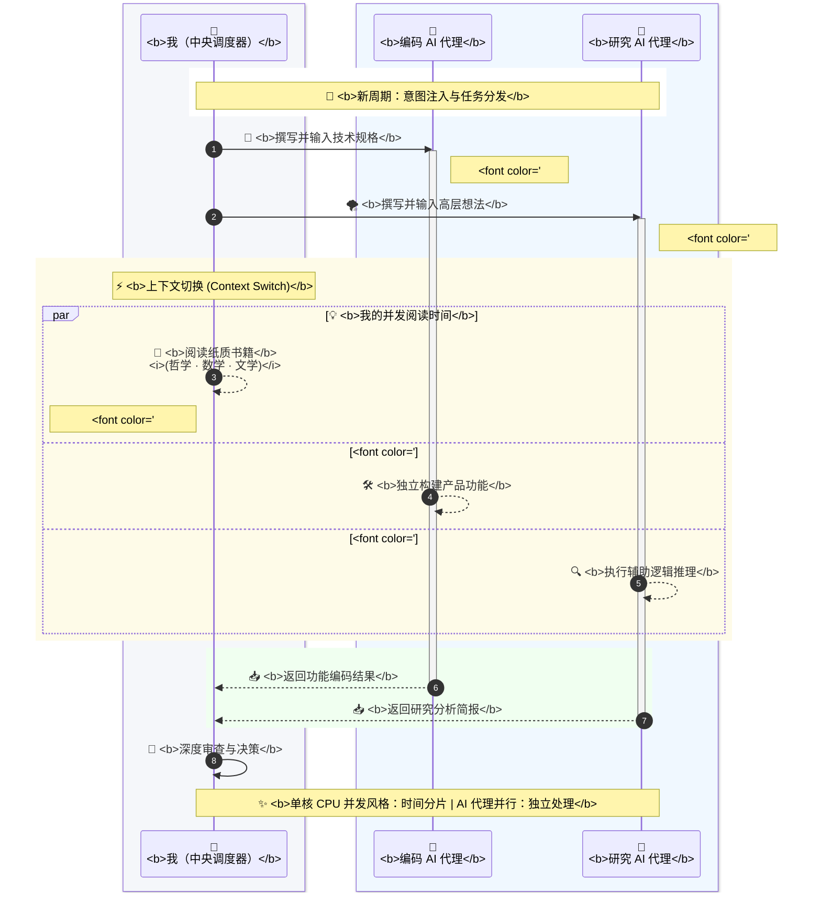
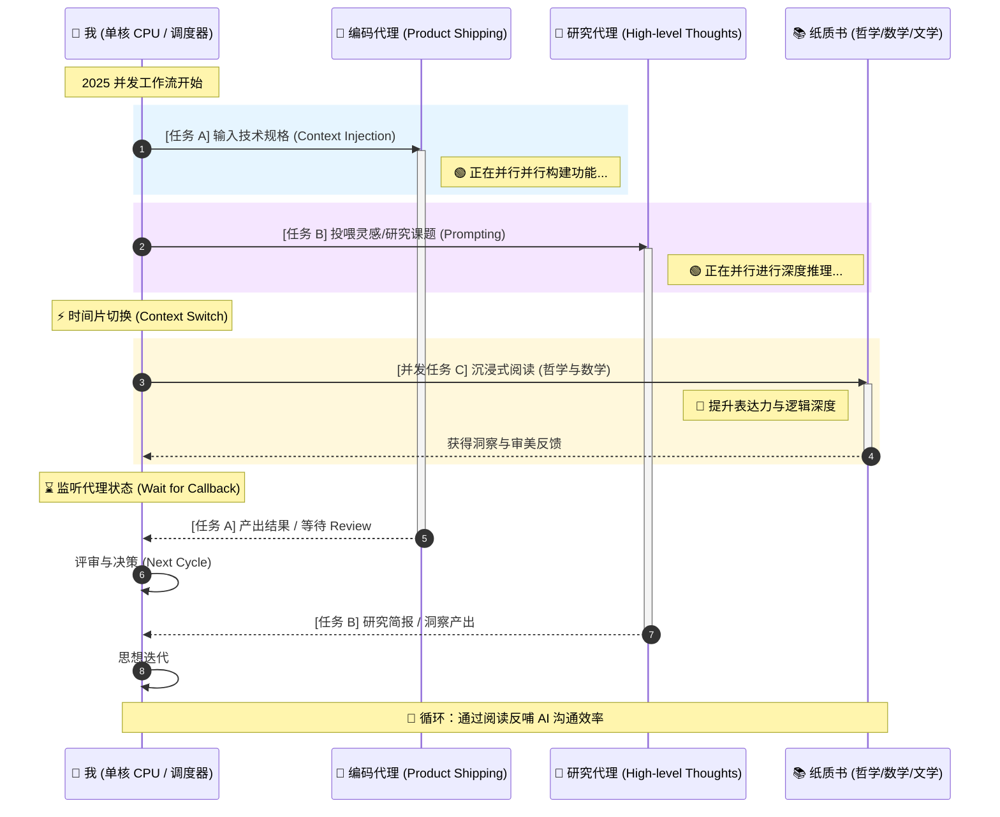

## One

```mermaid

sequenceDiagram
    autonumber
    
    %% 定义参与者，使用 Emoji 增强视觉表现力
    participant Me as 🧠 <br/><b>我（中央调度器）</b>
    participant Code as 🤖 <br/><b>编码 AI 代理</b>
    participant Think as 🎨 <br/><b>研究 AI 代理</b>

    box rgb(245, 247, 250) <font color='#2c3e50'><b>2025 并发工作流模式</b></font>
        participant Me
    end

    box rgb(240, 248, 255) <font color='#0077cc'><b>并行执行位面</b></font>
        participant Code
        participant Think
    end

    rect rgb(255, 255, 255)
    Note over Me, Think: 🔄 <b>新周期：意图注入与任务分发</b>
    end

    Me->>Code: 📝 <b>撰写并输入技术规格</b>
    activate Code
    Note right of Code: <font color='#1e88e5'><b>并行执行：</b></font> 功能开发中...

    Me->>Think: 🌪️ <b>撰写并输入高层想法</b>
    activate Think
    Note right of Think: <font color='#8e24aa'><b>并行执行：</b></font> 深度研究中...

    %% 核心并发部分，使用高亮色块区分精神阅读区
    rect rgb(254, 251, 232)
        Note over Me: ⚡ <b>上下文切换 (Context Switch)</b>
        par 💡 <b>我的并发阅读时间</b>
            Me-->>Me: 📖 <b>阅读纸质书籍</b><br/><i>(哲学 · 数学 · 文学)</i>
            Note left of Me: <font color='#d4a017'><b>内核升级：</b></font><br/>提升表达力与沟通效率
        and <font color='#455a64'><b>AI 异步处理</b></font>
            Code-->>Code: 🛠️ <b>独立构建产品功能</b>
        and <font color='#455a64'><b>AI 异步处理</b></font>
            Think-->>Think: 🔍 <b>执行辅助逻辑推理</b>
        end
    end

    %% 回调与审查
    rect rgb(240, 255, 240)
        Code-->>Me: 📥 <b>返回功能编码结果</b>
        deactivate Code
        Think-->>Me: 📥 <b>返回研究分析简报</b>
        deactivate Think
    end

    Me->>Me: 🧐 <b>深度审查与决策</b>
    
    Note over Me, Think: ✨ <b>单核 CPU 并发风格：时间分片 | AI 代理并行：独立处理</b>
```

## Two

```mermaid
sequenceDiagram
    autonumber
    
    %% 定义参与者，使用 Emoji 增强视觉表现力
    participant Me as 🧠 <br/><b>我（中央调度器）</b>
    participant Code as 🤖 <br/><b>编码 AI 代理</b>
    participant Think as 🎨 <br/><b>研究 AI 代理</b>

    box rgb(245, 247, 250) <font color='#2c3e50'><b>2025 并发工作流模式</b></font>
        participant Me
    end

    box rgb(240, 248, 255) <font color='#0077cc'><b>并行执行位面</b></font>
        participant Code
        participant Think
    end

    rect rgb(255, 255, 255)
    Note over Me, Think: 🔄 <b>新周期：意图注入与任务分发</b>
    end

    Me->>Code: 📝 <b>撰写并输入技术规格</b>
    activate Code
    Note right of Code: <font color='#1e88e5'><b>并行执行：</b></font> 功能开发中...

    Me->>Think: 🌪️ <b>撰写并输入高层想法</b>
    activate Think
    Note right of Think: <font color='#8e24aa'><b>并行执行：</b></font> 深度研究中...

    %% 核心并发部分，使用高亮色块区分精神阅读区
    rect rgb(254, 251, 232)
        Note over Me: ⚡ <b>上下文切换 (Context Switch)</b>
        par 💡 <b>我的并发阅读时间</b>
            Me-->>Me: 📖 <b>阅读纸质书籍</b><br/><i>(哲学 · 数学 · 文学)</i>
            Note left of Me: <font color='#d4a017'><b>内核升级：</b></font><br/>提升表达力与沟通效率
        and <font color='#455a64'><b>AI 异步处理</b></font>
            Code-->>Code: 🛠️ <b>独立构建产品功能</b>
        and <font color='#455a64'><b>AI 异步处理</b></font>
            Think-->>Think: 🔍 <b>执行辅助逻辑推理</b>
        end
    end

    %% 回调与审查
    rect rgb(240, 255, 240)
        Code-->>Me: 📥 <b>返回功能编码结果</b>
        deactivate Code
        Think-->>Me: 📥 <b>返回研究分析简报</b>
        deactivate Think
    end

    Me->>Me: 🧐 <b>深度审查与决策</b>
    
    Note over Me, Think: ✨ <b>单核 CPU 并发风格：时间分片 | AI 代理并行：独立处理</b>
```

```mermaid

sequenceDiagram
    autonumber
    participant Reader as 🧠 我 (单核 CPU / 调度器)
    participant Coder as 🤖 编码代理 (Product Shipping)
    participant Researcher as 🎨 研究代理 (High-level Thoughts)
    participant Books as 📚 纸质书 (哲学/数学/文学)

    Note over Reader: 2025 并发工作流开始

    rect rgb(230, 245, 255)
        Reader->>Coder: [任务 A] 输入技术规格 (Context Injection)
        activate Coder
        Note right of Coder: 🟢 正在并行并行构建功能...
    end

    rect rgb(245, 230, 255)
        Reader->>Researcher: [任务 B] 投喂灵感/研究课题 (Prompting)
        activate Researcher
        Note right of Researcher: 🟢 正在并行进行深度推理...
    end

    Note over Reader: ⚡ 时间片切换 (Context Switch)

    rect rgb(255, 248, 220)
        Reader->>Books: [并发任务 C] 沉浸式阅读 (哲学与数学)
        activate Books
        Note left of Books: 📖 提升表达力与逻辑深度
        Books-->>Reader: 获得洞察与审美反馈
        deactivate Books
    end

    Note over Reader: ⌛ 监听代理状态 (Wait for Callback)

    Coder-->>Reader: [任务 A] 产出结果 / 等待 Review
    deactivate Coder
    Reader->>Reader: 评审与决策 (Next Cycle)

    Researcher-->>Reader: [任务 B] 研究简报 / 洞察产出
    deactivate Researcher
    Reader->>Reader: 思想迭代

    Note over Reader, Books: 🔄 循环：通过阅读反哺 AI 沟通效率
```
